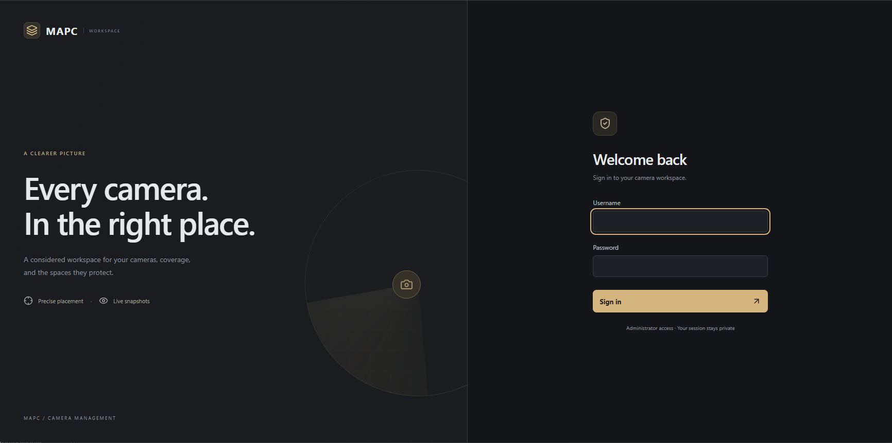
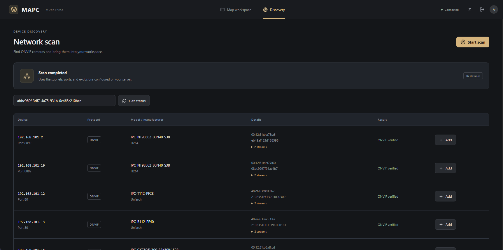
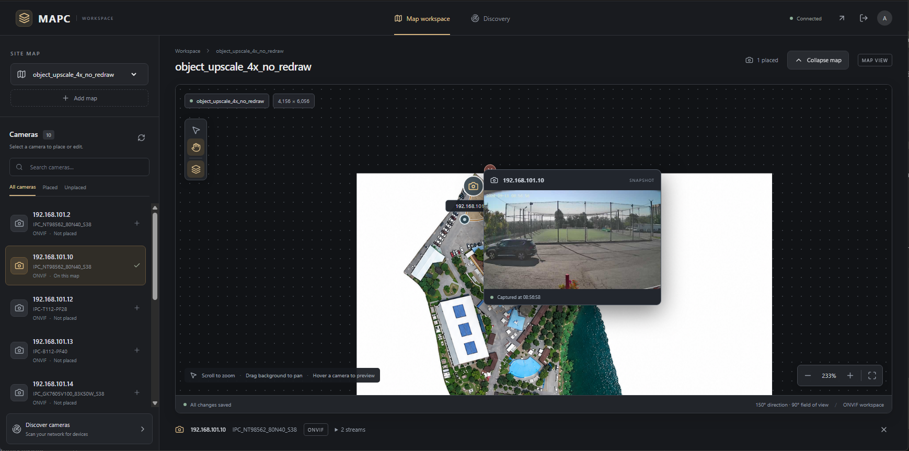

# MAPC

MAPC discovers ONVIF cameras and places them on floor plans or site maps.

## Interface

- **Sign in:** administrator username and password protect camera data and controls.
- **Discovery:** start a network scan, track its status, and inspect device
  addresses, ports, manufacturer, model, identifiers, and available streams.
  Failed ONVIF checks remain in the results with an error description.
  Existing database entries are marked as saved; new devices can be added
  directly from the results.
- **Map workspace:** upload original PNG or JPEG images, select a map, and
  search cameras or filter them by placement. Position camera icons and adjust
  coverage directly with the mouse. Changes save automatically.
- **Snapshot preview:** hover over a placed camera to request a fresh image and
  see what the camera covers. If ONVIF snapshot retrieval fails after profiles
  are available, the backend tries a single frame from the ONVIF-provided RTSP
  stream over TCP. Loading and camera errors appear in the preview.
  FFmpeg is included in the application Docker image; standalone installations
  must install it separately. Capture has a 10-second limit per stream and
  capture worker has a 30-second limit after a concurrency slot is available.
  Up to four captures run at once; the browser waits up to 45 seconds including
  queue time.
- **Map visibility:** Collapse map hides the canvas while keeping the camera
  list available. Expand map restores the view, including zoom and position.

Stream URIs are visible to authenticated users. Image uploads preserve the
original bytes and resolution, without an application size or pixel-count cap.

## Screenshots

### Sign in

Administrator sign-in screen in the neutral dark theme.



### Camera discovery

Network scan results with device details, available streams, and buttons for
adding verified ONVIF cameras to the database.



### Map workspace and snapshot preview

Camera placement on a zoomable site map, coverage controls, and a fresh snapshot
displayed when hovering over a camera marker.



## Configuration

Create a `.env` in the repository root before starting the application.
Use an Argon2 hash generated by the password reset command below for
`MAPC_ADMIN_PASSWORD`; the placeholder is not a working password.

```dotenv
MAPC_ADMIN_USER=admin
MAPC_ADMIN_PASSWORD='$argon2id$...'
MAPC_COOKIE_SECURE=false
MAPC_SESSION_TTL=28800
MAPC_USERNAMES=["onvif-user"]
MAPC_PASSWORDS=["replace-with-camera-password"]
MAPC_SCAN_NETWORKS=["192.168.0.0/24"]
MAPC_SCAN_PORTS=[80, 8000, 8999]
MAPC_EXCLUDED_IPS=["192.168.0.1"]
```

The addresses, ports, and credentials above are examples. List settings use JSON
arrays, without surrounding single quotes in these examples. JSON string
items still require double quotes. The application's dotenv reader also accepts
single-quoted values. Keep the administrator hash in single quotes so Compose
preserves its dollar signs. Do not source this file
as a shell script. Scan ports and subnets are configured only in `.env`; excluded addresses
are skipped during polling. Enable ONVIF and configure an ONVIF account on each
camera. Discovery uses ONVIF without an ISAPI fallback.

Optional scan controls are `MAPC_SCAN_SCANNER_TIMEOUT` (default 1 second),
`MAPC_SCAN_CAMERA_TIMEOUT` (15 seconds), `MAPC_SCAN_CONCURRENCY` (64, maximum 64),
and `MAPC_SCAN_CAMERA_CONCURRENCY` (32, maximum 32).

For standalone Python use, `MAPC_HOST` defaults to `127.0.0.1`,
`MAPC_PORT` to `8080`, and `MAPC_DATABASE_URL` to `sqlite:///./mapc.db`.
The Docker image sets container-specific values as described below.

## Authentication

The frontend and API share one origin and session cookie. Static interface files
are public so the login screen can load; camera data, map images, snapshots,
discovery endpoints, and API documentation require authentication.
State-changing API requests must include an Origin matching the application's
public address. Sessions expire after the configured lifetime and end when the
single backend process restarts.

## Docker Compose

This installation uses the standalone `docker-compose` command. Check it with
`docker-compose version`. If your machine has the Compose plugin instead, replace
`docker-compose` below with `docker compose`.

The root Dockerfile builds a single `mapc` image in separate stages:

- Node.js Alpine compiles the React/TypeScript frontend.
- Python slim with uv installs locked production dependencies and the application.
- The final Python slim image contains the installed application, compiled frontend,
  and FFmpeg for RTSP capture. Node.js, npm, uv, and build caches are not copied.

FastAPI/Uvicorn serves the interface, API, and static assets on port 8080.
Compose starts one service, `mapc`, with no separate frontend or proxy container.

From the repository root:

```bash
docker-compose -f compose.yaml up -d --build --remove-orphans
```

Open http://localhost:8080. Set `MAPC_WEB_PORT=8081` in the shell or `.env`
to change the published port. Use `docker-compose logs -f mapc` for logs and
`docker-compose down` to stop the application. When migrating from the previous
three-service configuration, `--remove-orphans` removes the old containers.

Compose reads `.env` normally; keep the administrator password hash in single
quotes to preserve dollar signs. The application reads the same file through
a read-only mount. The host directory `./data` is mounted at `/data`.
The application creates `data/mapc.db` and its tables automatically if missing.
Camera records, map images, and placements persist across container replacement.
Neither the database nor `.env` is copied into the image.

Docker overrides the bind address, application port, and database path.
Camera credentials, scan networks, scan ports, and exclusions still come from
`.env`. The container must have network access to the camera subnets.

The default deployment serves HTTP; use `MAPC_COOKIE_SECURE=false`.
Keep one application worker because sessions are held in process memory.
Restarting the container ends active sessions.

For an existing root-level `mapc.db`, stop the old backend before moving the
database and any SQLite sidecar files into `data/`. Deleting `data/mapc.db`
while the service is stopped creates an empty database at the next start;
deleted records are not restored.

You can also build and run the same image without Compose:

```bash
docker build -t mapc .
docker run -d --name mapc -p 8080:8080 \
  -v "$PWD/.env:/app/.env:ro" -v "$PWD/data:/data" mapc
```

## Resetting the administrator password

Use this procedure both to create the initial administrator password and to
reset it later. Generate a hash through the application image without starting
the service or mounting its database:

```bash
docker build -t mapc .
docker run --rm -it mapc /app/.venv/bin/python -m mapc.services.reset_password
```

For a local Python environment, run from the project root:

```bash
.venv/bin/python -m mapc.services.reset_password
```

1. Enter and confirm the new password. The minimum length is 5 characters.
2. Copy the generated Argon2 hash and replace `MAPC_ADMIN_PASSWORD` in `.env`.
   Enclose the entire hash in single quotes to preserve dollar signs:

   ```dotenv
   MAPC_ADMIN_PASSWORD='$argon2id$...'
   ```

3. Recreate the container so it remounts the current `.env`, then sign in:

   ```bash
   docker-compose -f compose.yaml up -d --force-recreate
   ```

The script only generates a hash; it does not modify `.env`. Restarting ends all
active sessions. Password reset through the web interface is not implemented.

This procedure changes only the MAPC administrator password, not camera passwords.

### Administrator credentials

The initial credentials in the current `.env` configuration are:

- Username: `admin`
- Password: `admin`

Credentials are read from `.env`; creating a new database does not reset them.

## Tests and validation

With Python 3.12 or newer and uv installed, run from the repository root:

```bash
uv sync
.venv/bin/python -m unittest discover -s tests -q
uvx ruff check .
```

Frontend tests can be run locally with Node.js 24 installed. These commands
are for development and validation; deployment builds the frontend automatically
through the root Dockerfile.

```bash
cd frontend
npm ci
npm test
npx playwright install --with-deps chromium
npm run test:e2e
```

Browser tests use mocked APIs and synthetic images. They do not query real
cameras or alter the production database. Screenshots are written to
`frontend/test-results/`.

To validate the complete production build, run `docker build -t mapc .`
from the repository root.

## Map controls

- Scroll to zoom around the pointer; use + / − or Fit map for quick navigation.
- Drag empty canvas to pan. Hold Space, use the middle mouse button, or select
  the hand tool to pan from any point.
- Select a camera in the sidebar. Click the image to place an unplaced camera.
- Drag a camera marker to reposition it. A simple click only selects it.
- Drag the center sector handle to change direction and range, or the edge
  handles to change the field of view. Changes save on release.
- Click × beside the selected camera to remove its placement.
- Hover a camera for a fresh snapshot. The layer button toggles coverage.

Coordinates are stored relative to the source image. Zooming and panning never
change saved positions. Markers and handles keep a constant screen size.


## Startup troubleshooting

The image healthcheck requests `/health` and checks database connectivity.
The public response contains only a status, with no camera data.

```bash
docker-compose -f compose.yaml ps
docker-compose -f compose.yaml logs --tail=80 mapc
```

After updating source, rebuild with:

```bash
docker-compose -f compose.yaml up -d --build --remove-orphans
```

Using `--no-build` only runs existing images and will not pick up source changes.


## Replacing or deleting a camera

Select a camera in the sidebar and click **Delete camera** in its details below
the map. Confirm deletion to remove the camera, its streams, and its placements
on every map. Map images and other cameras are preserved. Deletion cannot be
undone. To replace a device at the same IP and port, delete the old entry, run a
new discovery scan, and add the replacement camera.

The authenticated API also provides `DELETE /camera/{camera_id}` (204 on success,
404 if missing). As with other mutations, a matching Origin header is required.
